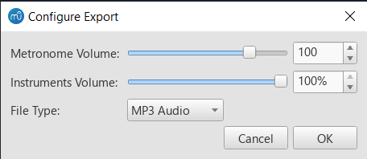

# [Export Audio with Metronome (v1.0)](https://musescore.org/en/project/export-audio-metronome)
A plugin for MuseScore 3 that includes the metronome when exporting audio files.

## Features
- Export audio in all of MuseScore 3's supported formats (.MP3, .WAV, .FLAC, .OGG)
- Adjust volume of the metronome and/or the track itself
- Accented first beats of every measure
- The plugin remembers your settings

## Installation
Unzip the [latest release](https://github.com/XiaoMigros/metronome-audio-export/releases/tag/v1.0) and move 'Export Audio with Metronome.qml' to MuseScore's plugins folder.

For more help installing this plugin, visit [this page](https://musescore.org/en/handbook/3/plugins#installation).

## Usage
- Run the plugin from 'File/Export Audio with Metronome'
- Specify metronome volume (absolute MIDI volume) and instruments volume (relative to their existing volume)
- Choose an output file type
- Choose where and what to write the file to
- Done!
